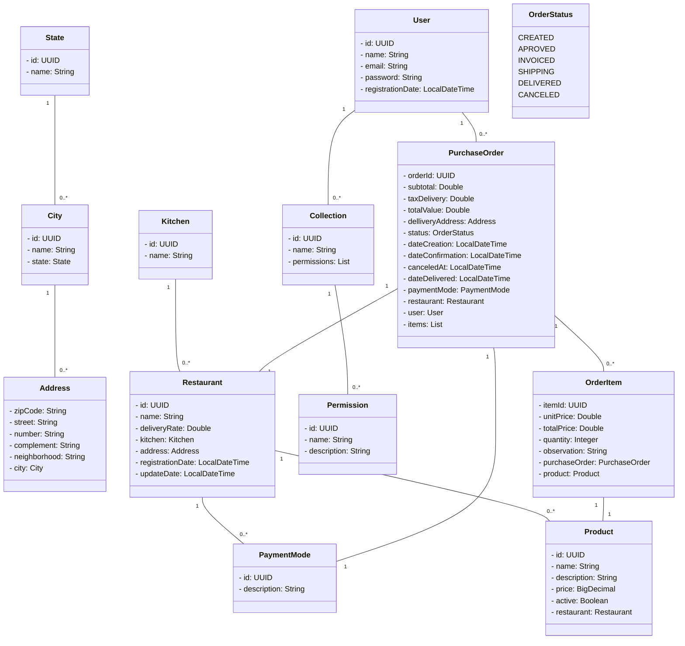

# Delivery API ThonDelivery

## Classes Diagram

```mermaid
   classDiagram
  class User {
    - id: UUID
    - name: String
    - email: String
    - password: String
    - registrationDate: LocalDateTime
  }

  class State {
    - id: UUID
    - name: String
  }

  class City {
    - id: UUID
    - name: String
    - state: State
  }

  class Address {
    - zipCode: String
    - street: String
    - number: String
    - complement: String
    - neighborhood: String
    - city: City
  }

  class Kitchen {
    - id: UUID
    - name: String
  }

  class Restaurant {
    - id: UUID
    - name: String
    - deliveryRate: Double
    - kitchen: Kitchen
    - address: Address
    - registrationDate: LocalDateTime
    - updateDate: LocalDateTime
  }

  class PaymentMode {
    - id: UUID
    - description: String
  }

  class Product {
    - id: UUID
    - name: String
    - description: String
    - price: BigDecimal
    - active: Boolean
    - restaurant: Restaurant
  }

  class Permission {
    - id: UUID
    - name: String
    - description: String
  }

  class Collection {
    - id: UUID
    - name: String
    - permissions: List<Permission>
  }

  class OrderStatus {
    CREATED
    APROVED
    INVOICED
    SHIPPING
    DELIVERED
    CANCELED
  }

  class PurchaseOrder {
    - orderId: UUID
    - subtotal: Double
    - taxDelivery: Double
    - totalValue: Double
    - delliveryAddress: Address
    - status: OrderStatus
    - dateCreation: LocalDateTime
    - dateConfirmation: LocalDateTime
    - canceledAt: LocalDateTime
    - dateDelivered: LocalDateTime
    - paymentMode: PaymentMode
    - restaurant: Restaurant
    - user: User
    - items: List<OrderItem>
  }

  class OrderItem {
    - itemId: UUID
    - unitPrice: Double
    - totalPrice: Double
    - quantity: Integer
    - observation: String
    - purchaseOrder: PurchaseOrder
    - product: Product
  }

  User "1" -- "0..*" Collection
  Collection "1" -- "0..*" Permission

  State "1" -- "0..*" City
  City "1" -- "0..*" Address

  Kitchen "1" -- "0..*" Restaurant
  Restaurant "1" -- "0..*" Product
  Restaurant "1" -- "0..*" PaymentMode

  User "1" -- "0..*" PurchaseOrder
  PurchaseOrder "1" -- "1" PaymentMode
  PurchaseOrder "1" -- "1" Restaurant
  PurchaseOrder "1" -- "0..*" OrderItem
  OrderItem "1" -- "1" Product

```